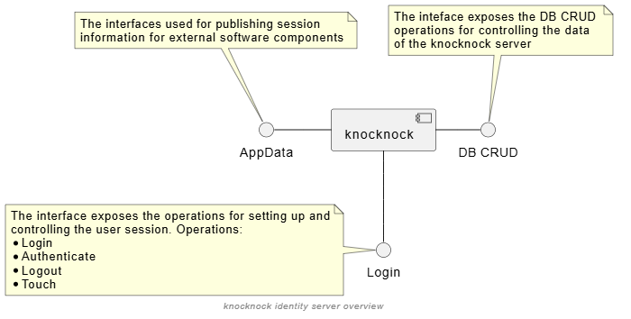

# knocknock

## Overview
The knocknock is an identity server that is dedicated for the embedded devices. The user list is stored in the SQLite database.

## Development
The server is implemented in the C++ with the intention to avoid newest C++ syntax, to make it possible to compile it with older C++ compilers.

### Installing the dependencies (on ubuntu)

`sudo apt-get install nlohmann-json3-dev sqlite3 libsqlite3-dev openssl libssl-dev libboost1.83-all-dev libargon2-dev` 

## Configuration

The configuration can be read from the configuration file and also from the database systemParameters table.

| Parameter name        | Type         | Description                     |
|:---| :---: | :--- |
| anonymousUserTemplate | string | Parameter specifies the userId of the template that will be used to create a anonymous user session.   If the parameter is equal to empty string - the anonumous login is dissallowed. |
| defaultAuthenticationMethod | string | The name of the user authentication method that is used in case there is not user specific method defined in the database   Supported authentication methods:   * checksum   * sha256   * simpledb   * scr |
| defaultAuthenticationString | string | The default parameterization of the authentication method, the semanticsdo of the contents is specific to the authentication method determined for the user |
| allowedAuthMethods | string | Allowed Auth methods:   * checksum   * sha256   * simpledb   * scr |
| sessionMaxAge | integer | |
| http.port | integer | HTTP listener port |
| http.cookieHttpOnly | bool | |
| http.cookiePath | string | "/"|
| http.cookieSecure| bool |false|
| http.cookieSameSite |[STRICT\|LAX\|NONE] | |
| maxLoginAttempts | integer | Maximum number of consecutive failed login attempts per userId before lockout. Default: 5 |
| loginLockoutSeconds | integer | Base lockout duration in seconds after exceeding max attempts. Doubles with each subsequent failure (exponential backoff), capped at 64x the base value. Default: 30 |

